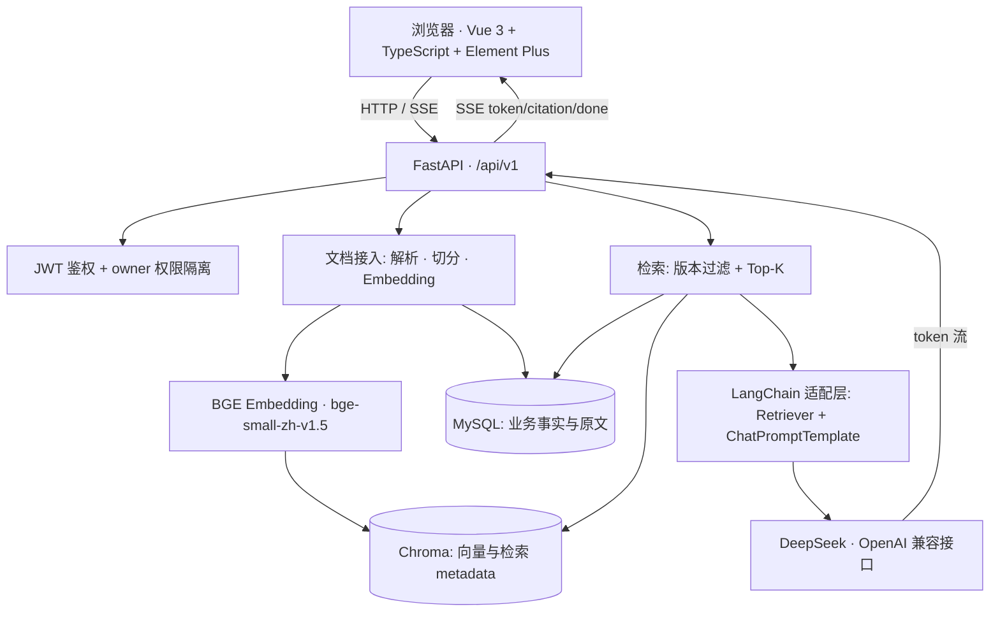

# DevAtlas

面向研发团队的版本化 RAG 知识协同平台。

团队的技术知识常常散落在个人电脑、聊天记录和过期的共享文档里：文档有多个版本却没人知道
哪一版才是当前生效的，换人接手只能靠口头交接，排障时翻到的资料又缺少可追溯的来源。
DevAtlas 用「逻辑文档 + 版本序列」管理知识，用 RAG 保证回答有据可依，用来源引用保证结论
可以回溯。

> **项目状态**：当前是**开发环境 / MVP**，用于本地开发、演示和技术验证，**没有生产环境
> 部署和上线记录**。本文所有描述以当前代码为准，未实现的能力统一放在
> [当前限制和后续规划](#当前限制和后续规划)，不会被描述为已具备。

## 技术栈

| 层次 | 选型 |
| --- | --- |
| 前端 | Vue 3、TypeScript、Vite、Element Plus、Pinia、Axios、markdown-it |
| 后端 | Python 3.13、FastAPI、Uvicorn、Pydantic |
| 数据库 | MySQL 8、SQLAlchemy 2、PyMySQL、Alembic |
| 向量库 | Chroma PersistentClient（collection `devatlas_knowledge_chunks`，余弦距离） |
| Embedding | 本地 `BAAI/bge-small-zh-v1.5`（sentence-transformers） |
| 大模型 | DeepSeek，OpenAI 兼容接口 |
| RAG 编排 | LangChain Core（Retriever 适配层 + ChatPromptTemplate） |
| 认证 | JWT（PyJWT）+ HTTP Bearer，密码 Argon2id 哈希 |
| 流式输出 | SSE |
| 测试 | pytest、`vue-tsc` 类型检查与 Vite 构建 |

## 系统架构



各组件职责：

| 组件 | 职责 |
| --- | --- |
| Vue 3 前端 | 页面交互、路由守卫、Axios 携带 JWT、解析 SSE、Markdown 安全渲染 |
| FastAPI | HTTP 接口、鉴权依赖、参数校验、SSE 响应、业务编排 |
| MySQL | 用户、知识库、逻辑文档、版本元数据、chunk 原文、故障记录与引用 |
| Chroma | chunk 向量与检索用 metadata |
| BGE Embedding | 本地把问题和 chunk 转成向量 |
| DeepSeek | 基于检索上下文生成回答 |
| LangChain Core | Retriever 适配层与 Prompt 模板 |

## 数据模型与文档版本管理

当前共 7 张表：

| 表 | 作用 |
| --- | --- |
| `users` | 用户、Argon2id 密码哈希、启用状态 |
| `knowledge_bases` | 知识库，`owner_id` 绑定所有者 |
| `documents` | **逻辑文档**，`current_version_id` 指向当前生效版本 |
| `document_versions` | 版本序列，保存 `file_sha256`、`file_size`、`status`、`error_message`、`chunk_count` |
| `document_chunks` | 切片原文、`chunk_index`、`vector_id`、页码与字符区间 |
| `incidents` | 故障分析记录与状态流转 |
| `incident_citations` | 故障分析引用到的 chunk |

版本管理的核心规则：

- 同一知识库下 `normalized_filename` 唯一，同名文件收敛到同一条逻辑文档；
- 同一文档下 `(document_id, version_number)` 与 `(document_id, file_sha256)` 都唯一，
  因此相同内容重复上传**不会**产生新版本，而是复用已有版本；
- 新版本先保持 `pending`，只有解析、切分、Embedding、Chroma 写入和 MySQL chunk 保存
  全部成功，才切换 `current_version_id` 并标记 `indexed`；
- 任一步失败时新版本记为 `failed` 并保留错误原因，旧的 `indexed` 版本继续参与检索。

## MySQL 与 Chroma 的分工

两个存储各管一段，不是简单的主从关系：

- **MySQL 是业务事实来源**：谁能访问、有哪些文档和版本、每个版本的状态、chunk 原文、
  故障记录与引用关系，全部以 MySQL 为准；
- **Chroma 只负责相似度检索**：保存 chunk 向量和检索必需的 metadata；
- 两者通过 `document_chunks.vector_id` 这一唯一键关联；
- 检索时用 metadata 过滤 `knowledge_base_id`、`document_version_id`（取当前 indexed 版本）
  和 `is_searchable=true`，确保只召回当前生效版本的内容。

写入跨两个存储，因此存在一致性问题。当前做法是：先写 Chroma 再写 MySQL，全部成功后才
切换当前版本；如果 Chroma 已写入部分向量但后续步骤失败，会执行补偿删除，避免 Chroma 中
残留孤立向量。删除文档的顺序是**先清理 Chroma 向量 → 再删除原始文件 → 最后删除 MySQL
记录**，这样不会在 MySQL 删除后丢失清理向量所需的 `vector_id`。

## RAG 检索流程

```text
用户问题
→ Pydantic 校验（空字符串和纯空格都返回 422）
→ 校验当前用户是否拥有该知识库
→ 从 MySQL 取出该知识库中 current_version_id 且 status = indexed 的版本
→ BGE 把问题转成向量
→ 以 knowledge_base_id + document_version_id + is_searchable 过滤 Chroma
→ 取距离最小的 Top-K 个 chunk
→ 拼装 context 并返回 sources（文档、版本、chunk、文件名、距离、页码）
→ 交给 LangChain ChatPromptTemplate 组织的 Prompt
→ DeepSeek 生成
→ 普通接口返回 JSON，流式接口返回 SSE
```

`top_k` 表示最多召回多少个最相似的切片，**不限制**最终回答长度。

## LangChain 的职责边界

这一点经常被追问，当前实现的边界是刻意划清的：

- **用了**：`langchain_core.retrievers.BaseRetriever` 做检索适配，
  `langchain_core.documents.Document` 做标准载体，`ChatPromptTemplate` 组织 Prompt；
- **没用**：LangChain 的 Agent、Chain 编排、Memory，也没有用它的向量库封装；
- 权限校验、版本过滤、Chroma 查询条件、DeepSeek 客户端、SSE 事件契约**仍全部由
  DevAtlas 自己控制**。

`DevAtlasRetriever._get_relevant_documents()` 内部调用的仍是项目自己的
`retrieve_context()`，LangChain 只提供标准接口形状，不接管安全边界。这样做是因为版本过滤
与 owner 隔离是业务正确性的前提，不适合交给框架的默认行为。

## JWT 权限隔离

- 登录接口使用 **JSON 请求体**（不是 OAuth2 Password Flow 的表单），成功后返回 JWT；
- 服务端通过 HTTP Bearer 解析 Token，按其中的用户 ID 查询用户，并校验用户仍存在且
  `is_active`；
- 知识库 `owner_id` 一律由服务端从当前用户推导，**不信任**客户端传入的所有者 ID；
- 文档、版本、故障记录的查询与删除同样叠加 owner 条件；
- 跨用户访问统一返回 `404` 而不是 `403`，避免泄露资源是否存在；
- 密码使用 Argon2id 哈希后入库，登录失败只返回统一的凭据错误，避免用户名枚举。

## SSE 流式输出

问答和故障分析都使用 `text/event-stream`，前端通过 `fetch + ReadableStream` 解析
（不用 `EventSource`，因为它无法携带 `Authorization` 头）。

| 事件 | 数据字段 |
| --- | --- |
| `token` | `{"text": "..."}` |
| `citation` | `{"index", "document_id", "version_id", "version_number", "chunk_index", "filename", "distance"}` |
| `done` | 问答：`{"conversation_id", "message_id"}`；故障：`{"incident_id", "status"}` |
| `error` | `{"code": "LLM_SERVICE_ERROR", "message": "大模型服务暂时不可用"}` |

正常顺序是多个 `token` → 多个 `citation` → `done`。没有检索到来源时不会调用大模型，
而是直接返回一条提示文本和 `done`。

## 故障分析

故障分析使用独立的 `incidents` 记录，**不会**把分析结果写回知识库文档。

流程：创建 `streaming` 记录 → 以「标题 + 故障描述」为查询检索（固定 `top_k = 5`）→
使用故障专用 Prompt 调用 DeepSeek → SSE 返回 `token` 和 `citation` → 完成后写入
`result` 与引用并标记 `completed`。

状态流转：`streaming → completed`（成功或无来源）、`streaming → failed`（大模型或检索
失败）、`streaming → cancelled`（客户端断开）。引用通过 `document_chunk_id` 关联到具体
切片，因此历史故障的引用可以回溯到当时的原文。

## 前端页面

| 路由 | 说明 |
| --- | --- |
| `/login`、`/register` | 登录和注册 |
| `/legal/terms`、`/legal/privacy` | 条款与隐私说明 |
| `/workspaces` | 当前用户的知识库列表、创建和删除 |
| `/knowledge/:id` | 知识库工作台 |
| `/knowledge/:id/documents` | 文档上传、状态查看、删除和重新索引 |
| `/knowledge/:id/qa` | 知识库问答（SSE）与引用展示 |
| `/knowledge/:id/incidents/new` | 发起故障分析（SSE） |
| `/incidents` | 故障历史、详情和删除 |

路由守卫基于 Pinia 中的登录状态：未登录访问受保护页面会跳转登录页并带上 `redirect`；
已登录访问登录/注册页会跳回 `/workspaces`。问答和故障分析结果通过
`frontend/src/utils/markdown.ts` 统一渲染，关闭原始 HTML 解析，避免模型输出被当作可执行
HTML。

## 项目结构

```text
RagKnowledgeSystem
├── backend
│   ├── app
│   │   ├── core          # 配置、安全工具、认证依赖、状态常量、文件安全校验
│   │   ├── db            # SQLAlchemy Base、Engine、Session
│   │   ├── models        # ORM 模型（7 张表）
│   │   ├── routers       # auth / knowledge_base / documents / retrieval / qa / incidents
│   │   ├── schemas       # 请求和响应模型
│   │   └── services      # 业务逻辑
│   ├── alembic           # 数据库迁移配置和版本
│   ├── scripts           # 开发种子数据脚本
│   └── requirements.txt
├── frontend              # Vue + TypeScript 前端
│   └── src
│       ├── api           # Axios、SSE 和业务接口封装
│       ├── router        # 页面路由和登录守卫
│       ├── stores        # Pinia 登录状态
│       ├── utils         # Markdown 安全渲染
│       └── views         # 登录、知识库、文档、问答和故障页面
├── docs                  # PRD、技术方案、API、架构和阶段总结
├── tests                 # 自动化测试与示例文档
└── others                # 本地生成文件（上传文件、Chroma 数据），不提交
```

## 快速开始

**环境要求**：Python 3.13、Node.js 20+、MySQL 8.x；内存建议 8 GB 以上。
首次运行 Embedding 需下载 `BAAI/bge-small-zh-v1.5`，请保证网络可达。

```powershell
# 1. 创建数据库
mysql -u root -p -e "CREATE DATABASE dev_atlas DEFAULT CHARACTER SET utf8mb4 COLLATE utf8mb4_unicode_ci;"

# 2. 配置环境变量（真实密码、JWT 密钥、API Key 只写在 .env，不提交）
Copy-Item .env.example .env

# 3. 安装后端依赖
python -m venv .venv
.\.venv\Scripts\Activate.ps1
python -m pip install -r backend\requirements.txt

# 4. 执行数据库迁移
alembic upgrade head

# 5. 启动后端
python -m uvicorn app.main:app --reload --app-dir backend --host 127.0.0.1 --port 8000

# 6. 另开一个窗口启动前端
Set-Location frontend
npm install
npm run dev -- --host 127.0.0.1 --port 5173
```

| 服务 | 地址 |
| --- | --- |
| 前端 | http://127.0.0.1:5173 |
| 后端健康检查 | http://127.0.0.1:8000/health 、`/health/db` |
| Swagger | http://127.0.0.1:8000/docs |

数据库表结构统一由 Alembic 迁移生成，不要手工改表。CORS 白名单只允许
`http://127.0.0.1:5173` 和 `http://localhost:5173`，换端口或域名必须同步修改
`backend/app/main.py`。

恢复本地开发数据（开发账号、示例知识库与 `tests` 下三个示例文档，幂等且不会重复建版本）：

```powershell
python backend/scripts/seed_dev_data.py
```

默认账号 `devatlas-demo` / `DevAtlas123!` **仅用于本地开发**。脚本在 `APP_ENV` 为
`production` 时会直接拒绝执行。

## 主要接口

完整说明（请求体、响应结构、SSE 事件格式、状态码）见
[docs/API使用说明.md](docs/API使用说明.md)，交互式文档见 `/docs`。
除健康检查和注册登录外，所有接口都需要 `Authorization: Bearer <access_token>`。

| 方法 | 路径 | 作用 |
| --- | --- | --- |
| GET | `/health`、`/health/db` | 服务存活与数据库连通性检查 |
| POST | `/api/v1/auth/register` | 注册 |
| POST | `/api/v1/auth/login` | 登录，返回 JWT（JSON 请求体） |
| GET | `/api/v1/auth/me` | 当前用户 |
| POST/GET | `/api/v1/knowledge-bases` | 创建 / 查询知识库 |
| GET/DELETE | `/api/v1/knowledge-bases/{kb_id}` | 知识库详情 / 删除 |
| POST | `/api/v1/knowledge-bases/{kb_id}/documents` | 上传文档（重复内容返回 200 + `duplicate=true`） |
| GET | `/api/v1/knowledge-bases/{kb_id}/documents` | 文档分页列表，可按 `status` 筛选 |
| GET | `/api/v1/knowledge-bases/{kb_id}/documents/{doc_id}` | 文档详情与当前版本 |
| GET | `.../{doc_id}/versions`、`.../versions/{version_id}` | 版本历史 / 指定版本 |
| DELETE | `/api/v1/knowledge-bases/{kb_id}/documents/{doc_id}` | 删除文档及其向量与文件 |
| POST | `.../{doc_id}/reindex` | 重新索引最新 `failed` 版本（无失败版本返回 409） |
| POST | `/api/v1/knowledge-bases/{kb_id}/search` | 直接检索，只召回不生成 |
| POST | `/api/v1/knowledge-bases/{kb_id}/qa` | 普通问答，一次性返回 JSON |
| POST | `/api/v1/knowledge-bases/{kb_id}/qa/stream` | 问答 SSE 流式输出 |
| POST | `/api/v1/knowledge-bases/{kb_id}/incidents/stream` | 故障分析 SSE |
| GET | `/api/v1/incidents`、`/api/v1/incidents/{id}` | 故障历史 / 详情 |
| DELETE | `/api/v1/incidents/{id}` | 删除故障记录 |

两个关键业务约定：

- 上传相同内容不会产生新版本，返回 `200` 且 `duplicate=true`（新建才返回 `201`）；
- 检索没有召回任何来源时**不会调用大模型**，问答直接返回「当前知识库中没有检索到与该
  问题相关的内容」，故障分析返回等价提示文本。

## 运行测试

```powershell
python -m compileall -q backend/app backend/scripts
python -m pytest tests -q

Set-Location frontend
npm run build          # 等价于 vue-tsc -b && vite build
```

| 命令 | 当前结果 |
| --- | --- |
| `compileall` | 通过，退出码 0 |
| `pytest tests -q` | **23 passed, 2 warnings** |
| `npm run build` | 成功，1692 modules transformed |

测试覆盖文档版本切换时机、解析／Embedding／Chroma 失败回退、文件安全边界（路径穿越、
非法扩展名、空文件、超大文件）、重复上传幂等、检索版本过滤与质量、LangChain 适配层、
文本切分与向量入库。2 个 warning 来自第三方依赖的 `DeprecationWarning`，不影响通过。

## 常见问题

**Q：启动后端报数据库连接失败？**
确认 MySQL 已启动、`dev_atlas` 已创建，且 `.env` 中 `DATABASE_URL` 的用户名、密码、端口
正确；`/health` 正常但 `/health/db` 失败说明是连不上库。

**Q：问答接口返回 502？**
`502` 表示 DeepSeek 调用失败，通常是缺少 `DEEPSEEK_API_KEY`、网络不通或接口超时。

**Q：问答返回「当前知识库中没有检索到与该问题相关的内容」？**
说明没有召回任何 chunk。确认文档状态已是 `indexed`，而不是 `pending` 或 `failed`。

**Q：上传后文档一直是 `failed`？**
查看文档详情接口的 `error_message`，再用 `reindex` 重试。常见原因是扫描版 PDF 无文本层。

**Q：前端请求被浏览器拦截？**
CORS 白名单只含 `127.0.0.1:5173` 和 `localhost:5173`，换端口需同步修改。

更多启动错误见 [docs/启动部署指南.md](docs/启动部署指南.md) 的「常见启动错误」表。

## 当前限制和后续规划

当前限制（均为真实状态）：

- 定位是开发环境 MVP，**没有生产部署、容器化和上线记录**；
- 没有 Redis 缓存、没有 Reranker 重排序、没有 OCR（扫描版 PDF 无法提取文本）；
- 没有 MCP、没有多 Agent 编排、没有微服务拆分、没有生产自动修复能力；
- 知识库共享与团队成员体系未实现，权限模型是**单用户 owner 隔离**；
- 问答历史未持久化，`conversation_id` 和 `message_id` 目前恒为 `null`；
- 没有刷新 Token、登出黑名单和找回密码；
- 前端未做代码分割，构建产物体积偏大；
- 没有真实用户量、准确率、召回率和吞吐量数据，也不会虚构这类指标。

后续规划（**均为未完成规划，不是已实现能力**）：

- 引入 Reranker 提升召回质量，并补充可量化的离线评测集；
- 支持知识库共享与更细粒度的团队权限；
- 持久化问答历史，落地 `conversation_id` / `message_id` 语义；
- 前端按路由做代码分割，降低首屏体积；
- 视真实需求评估缓存与异步任务队列（Redis 等），评估通过后再引入。

## 安全注意事项

- `.env` 保存数据库密码、`JWT_SECRET_KEY` 和 `DEEPSEEK_API_KEY`，已被 `.gitignore` 忽略，
  **永远不要提交**；仓库只保留占位符版本 `.env.example`；
- 上传文件校验扩展名（仅 `.md`、`.txt`、`.pdf`）、限制 10 MB、清理控制字符、使用随机
  存储名，并校验最终路径必须落在 `others/uploads` 内，防止路径穿越；
- 知识库、文档和故障记录的查询删除全部叠加 owner 条件，跨用户统一返回 `404`；
- 前端 Markdown 渲染关闭原始 HTML 解析，避免模型输出被当作可执行 HTML；
- 生产环境还需补充 HTTPS、密钥托管、病毒扫描、接口限流、审计日志和刷新 Token 机制，
  这些在 MVP 阶段均未实现。

## 文档导航

| 文档 | 内容 |
| --- | --- |
| [docs/项目介绍.md](docs/项目介绍.md) | 项目背景、用户角色、痛点、MVP 范围、亮点与难点 |
| [docs/架构说明.md](docs/架构说明.md) | Mermaid 总体架构、鉴权、上传索引、RAG、SSE、故障分析与数据一致性 |
| [docs/启动部署指南.md](docs/启动部署指南.md) | 从零启动、迁移、种子数据与常见错误排查 |
| [docs/API使用说明.md](docs/API使用说明.md) | 全部接口、请求示例、SSE 事件格式与状态码 |
| [docs/开发与测试指南.md](docs/开发与测试指南.md) | 开发环境、测试命令与各类验证场景 |
| [docs/05-数据库设计.md](docs/05-数据库设计.md) | 数据库设计说明 |

## Git 提交约定

每完成一个可验证功能再提交：

```powershell
git status
git add <本次修改的文件>
git commit -m "<type>: <description>"
git log -1 --oneline
```

`.env`、`node_modules`、上传文件和本地向量数据不会提交到仓库。
