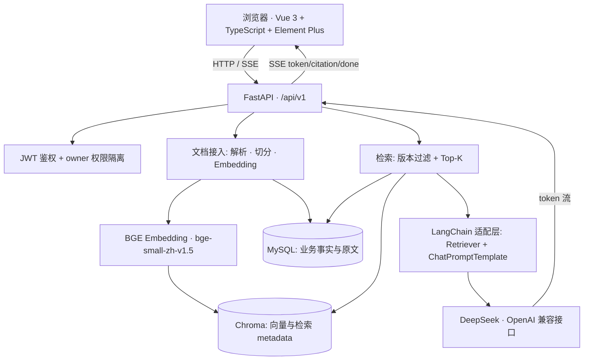

# DevAtlas

研发知识协同平台。

DevAtlas 面向研发和运维团队，集中管理版本化技术知识，并通过 RAG 和大模型辅助故障分析。第一版的核心目标是让用户能够上传团队文档，在权限范围内检索知识，并获得带来源引用的 AI 分析结果。

> **项目状态说明**：DevAtlas 当前是**开发环境 / MVP 项目**，用于本地开发、演示和技术验证，
> **没有生产环境部署和上线记录**。README 中所有能力描述均以当前代码为准，未实现的能力
> 一律放在「当前限制和后续规划」中，不会被描述为已具备。

## 当前技术栈

- 前端：Vue 3、TypeScript、Vite、Element Plus、Pinia、Axios
- 后端：Python 3.13、FastAPI、Uvicorn、Pydantic
- 数据库：MySQL 8、SQLAlchemy 2、PyMySQL、Alembic
- 向量库：Chroma Persistent Client
- Embedding：本地 `BAAI/bge-small-zh-v1.5`
- LLM：DeepSeek（目标模型：`deepseek-v4-flash`）
- RAG 编排：LangChain Core（Retriever 适配、ChatPromptTemplate）
- 认证：JWT、HTTP Bearer
- 密码安全：Argon2id 哈希
- 流式输出：SSE

## 项目解决的问题和目标用户

研发和运维团队的技术知识长期散落在个人电脑、聊天记录和过期的共享文档里，常见问题是：
文档有多个版本但没人知道哪一版才是当前生效的；换人接手后只能靠口头交接；排障时
需要人工翻找资料，得到的结论又缺少可追溯的来源。

DevAtlas 的目标用户是：

- 需要沉淀和交接技术资料的研发团队成员；
- 需要按既定手册快速定位线上问题的运维／值班人员；
- 需要带来源依据做故障复盘的负责人。

DevAtlas 用「逻辑文档 + 版本序列」管理知识，用 RAG 检索保证回答有据可依，
用来源引用保证结论可追溯。

## 系统架构



各组件职责：

| 组件 | 真实职责 |
| --- | --- |
| Vue 3 前端 | 登录注册、知识库与文档管理、问答与故障分析页面、SSE 解析、Markdown 安全渲染 |
| FastAPI | HTTP 接口、鉴权依赖、参数校验、SSE 响应、业务编排 |
| MySQL | 用户、知识库、逻辑文档、版本元数据、chunk 原文、故障记录与引用 |
| Chroma | chunk 向量与检索用 metadata |
| BGE Embedding | 本地把问题和 chunk 转成向量 |
| DeepSeek | 基于检索上下文生成回答 |
| LangChain Core | Retriever 适配层与 Prompt 模板 |

## 数据模型和文档版本管理

当前共 7 张表：

| 表 | 作用 |
| --- | --- |
| `users` | 用户、Argon2id 密码哈希、启用状态 |
| `knowledge_bases` | 知识库，`owner_id` 绑定所有者 |
| `documents` | **逻辑文档**，用 `current_version_id` 指向当前生效版本 |
| `document_versions` | 版本序列，保存 `file_sha256`、`file_size`、`status`、`error_message`、`chunk_count` |
| `document_chunks` | 切片原文、`chunk_index`、`vector_id`、页码与字符区间 |
| `incidents` | 故障分析记录与状态流转 |
| `incident_citations` | 故障分析引用到的 chunk |

版本管理的核心规则：

- 同一知识库下 `normalized_filename` 唯一，保证同名文件收敛到同一条逻辑文档；
- 同一文档下 `(document_id, version_number)` 与 `(document_id, file_sha256)` 都唯一，
  因此相同内容重复上传**不会**产生新版本，而是复用已有版本；
- 新版本创建后先保持 `pending`，只有解析、切分、Embedding、Chroma 写入和 MySQL chunk
  保存全部成功，才切换 `current_version_id` 并标记 `indexed`；
- 任一步失败时新版本记为 `failed` 并保留错误原因，旧的 `indexed` 版本继续参与检索。

## MySQL 与 Chroma 的分工

两个存储不是简单的主从关系，而是各管一段：

- **MySQL 是业务事实来源**：谁能访问、有哪些文档和版本、每个版本是什么状态、chunk 原文
  是什么、故障记录和引用关系，全部以 MySQL 为准；
- **Chroma 只负责相似度检索**：保存 chunk 向量和检索必需的 metadata；
- 两者通过 `document_chunks.vector_id` 这一唯一键关联；
- 检索时用 metadata 过滤 `knowledge_base_id`、`document_version_id`（取当前 indexed 版本）
  和 `is_searchable=true`，确保只召回当前生效版本的内容。

因为写入跨两个存储，所以存在一致性问题。当前实现的做法是：编排层先写 Chroma 再写
MySQL，全部成功后才切换当前版本；如果 Chroma 已写入部分向量但后续步骤失败，会执行
补偿删除，避免 Chroma 中残留孤立向量。删除文档时的顺序是先清理 Chroma 向量，再删除
原始文件，最后删除 MySQL 记录——这样不会在 MySQL 删除后丢失清理向量所需的 `vector_id`。

## RAG 检索流程

```text
用户问题
→ Pydantic 校验（空字符串和纯空格都返回 422）
→ 校验当前用户是否拥有该知识库
→ 从 MySQL 取出该知识库中 status = indexed 的版本
→ BGE 把问题转成向量
→ 以 knowledge_base_id + document_version_id + is_searchable 过滤 Chroma
→ 取距离最小的 Top-K 个 chunk
→ 拼装 context 并返回 sources（文档、版本、chunk、文件名、距离、页码）
→ 交给 LangChain ChatPromptTemplate 组织的 Prompt
→ DeepSeek 生成
→ 普通接口返回 JSON，流式接口返回 SSE
```

`top_k` 表示最多召回多少个最相似的切片，**不限制**最终回答长度。

## LangChain 的职责边界

这一点在面试中经常被追问，当前实现的边界是刻意划清的：

- **用了**：`langchain_core.retrievers.BaseRetriever` 做检索适配，
  `langchain_core.documents.Document` 做标准载体，`ChatPromptTemplate` 组织 Prompt；
- **没用**：LangChain 的 Agent、Chain 编排、Memory，也没有用它的向量库封装；
- 权限校验、版本过滤、Chroma 查询条件、DeepSeek 客户端、SSE 事件契约**仍然全部由
  DevAtlas 自己控制**。

`DevAtlasRetriever._get_relevant_documents()` 内部调用的仍是项目自己的
`retrieve_context()`，LangChain 只提供标准接口形状，不接管安全边界。这样做的原因是：
版本过滤和 owner 隔离是业务正确性的前提，不适合交给框架的默认行为。

## JWT 权限隔离

- 登录接口使用 **JSON 请求体**（不是 OAuth2 Password Flow 的表单），成功后返回 JWT；
- 服务端通过 HTTP Bearer 解析 Token，再按 Token 中的用户 ID 查询用户，并校验用户仍然
  存在且 `is_active`；
- 知识库的 `owner_id` 一律由服务端从当前用户推导，**不信任**客户端传入的所有者 ID；
- 文档、版本、故障记录的查询与删除同样叠加 owner 条件；
- 跨用户访问统一返回 `404` 而不是 `403`，避免泄露资源是否存在；
- 密码使用 Argon2id 哈希后入库，登录失败只返回统一的凭据错误，避免用户名枚举。

## SSE 流式输出

问答和故障分析都使用 `text/event-stream`，通过 `fetch + ReadableStream` 在前端解析。

事件类型：

| 事件 | 数据字段 |
| --- | --- |
| `token` | `{"text": "..."}` |
| `citation` | `{"index", "document_id", "version_id", "version_number", "chunk_index", "filename", "distance"}` |
| `done` | 问答：`{"conversation_id", "message_id"}`；故障：`{"incident_id", "status"}` |
| `error` | `{"code": "LLM_SERVICE_ERROR", "message": "大模型服务暂时不可用"}` |

正常顺序是多个 `token` → 多个 `citation` → `done`。没有检索到来源时不会调用大模型，
而是直接返回一条提示文本和 `done`。

## 故障分析

故障分析使用独立的 `incidents` 记录，不会把分析结果写回知识库文档。

流程：创建 `streaming` 状态的记录 → 以「标题 + 故障描述」作为查询做检索
（固定 `top_k = 5`）→ 使用故障专用 Prompt 调用 DeepSeek → SSE 返回 `token` 和
`citation` → 完成后写入 `result` 与引用并标记 `completed`。

状态流转：`streaming → completed`（成功）、`streaming → failed`（大模型失败或检索失败）、
`streaming → cancelled`（客户端主动断开）。故障历史和引用记录都可以在 `/incidents`
页面回看，引用会关联到具体 chunk。

## 前端页面

| 路由 | 说明 |
| --- | --- |
| `/login`、`/register` | 登录和注册 |
| `/legal/terms`、`/legal/privacy` | 条款与隐私说明页 |
| `/workspaces` | 当前用户的知识库列表、创建和删除 |
| `/knowledge/:id` | 知识库工作台 |
| `/knowledge/:id/documents` | 文档上传、状态查看、删除和重新索引 |
| `/knowledge/:id/qa` | 知识库问答（SSE）与引用展示 |
| `/knowledge/:id/incidents/new` | 发起故障分析（SSE） |
| `/incidents` | 故障历史、详情和删除 |

路由守卫基于 Pinia 中的登录状态：未登录访问受保护页面会跳转登录页并带上 `redirect`；
已登录访问登录/注册页会跳回 `/workspaces`。问答和故障分析结果使用
`frontend/src/utils/markdown.ts` 统一渲染，关闭原始 HTML 解析，避免模型输出被当作
可执行 HTML。

## 当前开发状态

当前处于阶段 7 的正式开发阶段，已完成：

- T01：项目基础初始化、FastAPI 健康检查、Vue 项目初始化；
- T02：`.env` 配置管理和配置缺失检查；
- T03：SQLAlchemy、MySQL、Alembic 和 `users` 表迁移；
- T04：用户注册、登录、密码哈希、JWT 签发与当前用户鉴权。
- T05：知识库 CRUD、`owner_id` 所有者绑定和跨用户权限校验。
- T06：文件上传安全校验、原始文件保存和 SHA-256 指纹计算。
- T07：TXT/Markdown/PDF 文档解析、文本切分、逻辑文档与版本管理、重复内容幂等和失败状态保留；优化阶段已补充版本切换和失败回退保障。
- T08：本地 BGE Embedding、Chroma 向量入库、chunk metadata、稳定 `vector_id` 和失败补偿。
- T09：文档列表、详情、版本历史、单版本查询、文档删除和失败版本重新索引。
- T10：问题 Embedding、当前知识库 indexed 版本过滤、Chroma Top-K 检索、上下文组装和来源 metadata 返回。
- T11：DeepSeek 普通调用、RAG Prompt、统一 LLM 错误转换和带来源的普通问答接口。
- T12：知识库问答 SSE 流式输出、token/citation/done/error 事件和 DeepSeek 流式调用。
- T13：故障分析 SSE、incidents/incident_citations 持久化、状态流转、历史查询、详情和删除。
- T14：Vue 前端基础设施、登录注册、知识库工作台、文档管理、普通问答 SSE、故障分析 SSE 和浏览器端完整联调。

下一步：

- T15：测试、修复和交付材料（MVP 已完成）。
- 优化阶段 P0：已完成文档版本切换时机修复、当前 indexed 版本过滤、重复上传幂等、解析/Embedding/Chroma 失败回退和文件边界测试。
- 优化阶段 P1：已完成文档状态常量、处理阶段日志、前端状态中文映射，以及 Top-K、无答案和引用 metadata 的可复现检索测试。
- 优化阶段 P2：已接入 LangChain Retriever 和 ChatPromptTemplate；保留自定义权限、版本过滤、Chroma 查询、DeepSeek 客户端和 SSE 契约。
- 前端展示优化：问答和故障分析结果支持安全的 Markdown 渲染，标题、列表、表格、代码和引用块可读性更好。
- 优化阶段下一步：根据真实需求评估 Redis、Reranker 等增强项；Redis、MCP、多 Agent 等仍不主动加入。

## 项目结构

```text
RagKnowledgeSystem
├── backend
│   ├── app
│   │   ├── core          # 配置、安全工具、认证依赖、状态常量、文件安全校验
│   │   ├── db            # SQLAlchemy Base、Engine、Session
│   │   ├── models        # ORM 模型（7 张表）
│   │   ├── routers       # HTTP 路由（auth / knowledge_base / documents / retrieval / qa / incidents）
│   │   ├── schemas       # 请求和响应模型
│   │   └── services      # 业务逻辑
│   ├── alembic           # 数据库迁移配置和版本
│   ├── scripts           # 开发种子数据脚本
│   └── requirements.txt
├── frontend              # Vue + TypeScript 前端
│   └── src
│       ├── api           # Axios、SSE 和业务接口封装
│       ├── router        # 页面路由和登录守卫
│       ├── stores        # Pinia 登录状态
│       ├── utils         # Markdown 安全渲染
│       └── views         # 登录、知识库、文档、问答和故障页面
├── docs                  # PRD、技术方案、API、架构和阶段总结
├── tests                 # 自动化测试与示例文档
└── others                # 本地生成文件（上传文件、Chroma 数据），不提交
```

## 文档导航

| 文档 | 内容 |
| --- | --- |
| [docs/项目介绍.md](docs/项目介绍.md) | 项目背景、用户角色、痛点、MVP 范围、亮点与难点 |
| [docs/架构说明.md](docs/架构说明.md) | Mermaid 总体架构、鉴权、上传索引、RAG、SSE、故障分析与数据一致性 |
| [docs/启动部署指南.md](docs/启动部署指南.md) | Windows PowerShell 从零启动、迁移、种子数据与常见错误 |
| [docs/API使用说明.md](docs/API使用说明.md) | 全部真实接口、请求示例、SSE 事件格式与状态码 |
| [docs/开发与测试指南.md](docs/开发与测试指南.md) | 开发环境、测试命令与各类验证场景 |
| [docs/05-API接口文档.md](docs/05-API接口文档.md) | 设计阶段 API 文档（历史资料） |
| [docs/05-数据库设计.md](docs/05-数据库设计.md) | 数据库设计说明 |

## 环境配置

复制配置模板：

```powershell
Copy-Item .env.example .env
```

然后在 `.env` 中配置本机 MySQL、JWT 和 DeepSeek 参数。真实密码、JWT 密钥和 API Key 只保存在 `.env`，不要提交到 Git。

当前数据库配置约定：

```text
MySQL: 127.0.0.1:3306
Database: dev_atlas
User: root
```

## 启动后端

在项目根目录执行：

```powershell
python -m uvicorn app.main:app --reload --app-dir backend --host 127.0.0.1 --port 8000
```

健康检查：

```text
http://127.0.0.1:8000/health
http://127.0.0.1:8000/health/db
```

Swagger：

```text
http://127.0.0.1:8000/docs
```

## 恢复本地开发种子数据

如果本地测试删除了知识库、文档或故障记录，可以在项目根目录执行：

```powershell
python backend/scripts/seed_dev_data.py
```

执行前请先确认数据库已完成迁移：

```powershell
alembic upgrade head
```

脚本会幂等地创建开发账号和“DevAtlas 开发演示知识库”，并导入 `tests` 目录中的 TXT、Markdown、PDF 示例文档。相同文件内容会通过 SHA-256 检查，不会重复创建版本。

默认开发账号为 `devatlas-demo`，默认开发密码为 `DevAtlas123!`。也可以显式传入，或使用环境变量：

```powershell
python backend/scripts/seed_dev_data.py --username devatlas-demo --password "你的本地开发密码"
```

该脚本只用于本地 development 环境，不要在生产数据库执行，也不要把真实密码写入脚本或提交到 Git。

## 启动前端

```powershell
Set-Location frontend
npm install
npm run dev -- --host 127.0.0.1 --port 5173
```

前端地址：

```text
http://127.0.0.1:5173
```

前端通过 `frontend/.env.local` 中的 `VITE_API_BASE_URL` 请求后端，默认后端端口为 `8000`。该文件只保存本地地址，不提交到 Git。

## 当前前端联调功能（T14）

已完成浏览器主链路：

```text
注册 → 登录 → 创建知识库 → 上传文档 → indexed
→ RAG 问答 SSE → 故障分析 SSE → 查看历史 → 删除记录 → 退出登录
```

主要页面：

- `/login`、`/register`：登录和注册；
- `/workspaces`：当前用户知识库列表、创建和删除；
- `/knowledge/:id`：知识库工作台；
- `/knowledge/:id/documents`：文档上传、状态、删除和重新索引；
- `/knowledge/:id/qa`：普通问答 SSE 和引用展示；
- `/knowledge/:id/incidents/new`：故障分析 SSE；
- `/incidents`：故障分析历史、详情和删除。

前端使用 Axios 统一携带 JWT，使用 `fetch + ReadableStream` 解析 SSE 的 `token`、`citation`、`done` 和 `error` 事件。后端通过 CORS 允许本地 `5173` 前端访问 `8000` API。

问答页和故障分析页使用 `frontend/src/utils/markdown.ts` 统一渲染模型返回的 Markdown，关闭原始 HTML 解析，避免模型输出被当作可执行 HTML；前端只改变展示方式，不改变后端 API 和 SSE 事件协议。

## 数据库迁移

在项目根目录执行：

```powershell
alembic upgrade head
```

查看当前迁移版本：

```powershell
alembic current
```

数据库结构变更必须通过 Alembic，不直接手动修改生产表结构。

## 当前认证接口

接口前缀：`/api/v1/auth`

### 注册

```text
POST /api/v1/auth/register
```

请求：

```json
{
  "username": "alice",
  "password": "password123"
}
```

用户名长度为 3-50，密码长度为 8-128。密码经过 Argon2id 哈希后才保存到 MySQL。

### 登录

```text
POST /api/v1/auth/login
```

登录成功后返回 JWT `access_token`。登录接口使用 JSON 请求体，不是 OAuth2 Password Flow 的表单请求。

### 当前用户

```text
GET /api/v1/auth/me
Authorization: Bearer <access_token>
```

服务端验证 JWT 后，根据 Token 中的用户 ID 查询当前用户，并检查用户是否仍然存在且处于启用状态。

## 已验证的认证场景

- 正常注册：`201 Created`；
- 重复用户名：`409 Conflict`；
- 注册密码过短：`422 Unprocessable Entity`；
- 正确登录：`200 OK`，返回 access token；
- 错误密码：`401 Unauthorized`；
- 无 Token 访问 `/me`：`401 Unauthorized`；
- 伪造或失效 Token：`401 Unauthorized`；
- 合法 Token 访问 `/me`：`200 OK`。

## 当前知识库接口

接口前缀：`/api/v1/knowledge-bases`

- `POST /api/v1/knowledge-bases`：创建知识库；
- `GET /api/v1/knowledge-bases`：查询当前用户自己的知识库；
- `GET /api/v1/knowledge-bases/{knowledge_base_id}`：查询当前用户有权访问的知识库；
- `DELETE /api/v1/knowledge-bases/{knowledge_base_id}`：删除当前用户自己的知识库。

知识库的 `owner_id` 由服务端根据 JWT 中的当前用户确定，不信任客户端传入的所有者 ID。详情和删除查询同时校验资源 ID 与 `owner_id`；其他用户访问时返回 `404`，避免泄露资源是否存在。同一用户下知识库名称不能重复，重复创建返回 `409`。

已验证用户 A、用户 B 的跨用户访问边界：用户 B 看不到、读取不了、删除不了用户 A 的知识库。

## 当前文件上传接口

```text
POST /api/v1/knowledge-bases/{knowledge_base_id}/documents
```

T06 当前已完成原始文件的安全保存：

- 允许 `.md`、`.txt`、`.pdf`；
- 单文件最大 10 MB；
- 规范化文件名并清理控制字符；
- 使用随机存储名，避免同名覆盖；
- 校验最终路径必须位于 `others/uploads` 内；
- 分块写入文件并计算 SHA-256；
- 拒绝空文件、非法格式和超大文件；
- 上传失败时清理半成品；
- 上传前校验当前用户是否拥有目标知识库。

上传接口会继续执行文档解析、文本切分、版本状态更新、Embedding 和 Chroma 入库；成功版本为 `indexed`，处理失败会保留 `failed` 版本和错误信息。

### 文档版本可靠性保障（优化阶段 P0）

新版本创建后先保持 `pending`，不会立即覆盖逻辑文档的 `current_version_id`。只有解析、切分、Embedding、Chroma 写入和 MySQL chunk 保存全部成功后，才将新版本切换为当前版本并标记为 `indexed`。任一步失败时，新版本记录为 `failed` 并保存错误原因，旧的 `indexed` 版本继续参与检索；如果 Chroma 已写入部分向量，还会执行补偿删除，避免 MySQL 与 Chroma 出现孤立数据。

优化阶段已通过以下自动化验证：

- 解析失败、Embedding 失败、Chroma 写入失败时旧版本仍可检索；
- 失败版本的错误原因会被保留；
- 重复内容通过 SHA-256 幂等处理，不创建新版本并清理临时文件；
- 路径穿越、非法扩展名、文件名规范化和空文本 PDF 等边界输入有明确失败结果。

测试命令：

```powershell
python -m pytest tests -q
```

当前结果：`23 passed`，仅有第三方依赖的 `DeprecationWarning`，不影响测试通过。

## 当前文档管理接口（T09）

所有接口都需要携带：

```text
Authorization: Bearer <access_token>
```

- `GET /api/v1/knowledge-bases/{knowledge_base_id}/documents`：分页查询知识库文档，可按 `status=pending|indexed|failed` 筛选；
- `GET /api/v1/knowledge-bases/{knowledge_base_id}/documents/{document_id}`：查询文档详情和当前版本；
- `GET /api/v1/knowledge-bases/{knowledge_base_id}/documents/{document_id}/versions`：查询版本历史；
- `GET /api/v1/knowledge-bases/{knowledge_base_id}/documents/{document_id}/versions/{version_id}`：查询指定版本；
- `DELETE /api/v1/knowledge-bases/{knowledge_base_id}/documents/{document_id}`：删除文档、版本、chunk、原始文件和向量；
- `POST /api/v1/knowledge-bases/{knowledge_base_id}/documents/{document_id}/reindex`：重新处理该文档最新的 `failed` 版本。

路径中的 ID 含义：`knowledge_base_id` 是知识库 ID，`document_id` 是逻辑文档 ID，`version_id` 是 `document_versions.id` 的版本记录主键；`version_number` 只是同一逻辑文档内的版本序号，不能替代 `version_id`。

T09 的删除顺序为先清理 Chroma 向量，再删除原始文件，最后删除 MySQL 业务记录，避免数据库删除后丢失向量清理所需的 `vector_id`。没有 `failed` 版本时调用重新索引接口返回 `409 Conflict` 属于正常业务结果。

## 当前 RAG 检索接口（T10）

```text
POST /api/v1/knowledge-bases/{knowledge_base_id}/search
```

请求体：

```json
{
  "question": "忘记密码后应该怎么办？",
  "top_k": 3
}
```

检索流程为：先校验当前用户是否拥有知识库，再从 MySQL 找出该知识库中状态为 `indexed` 的版本，将问题转换为 Embedding，使用知识库 ID、版本 ID 和 `is_searchable=true` 作为 Chroma metadata 过滤条件，最后返回距离最小的 Top-K 文档块。

接口返回 `context` 和 `sources`，其中 `context` 是检索到的原文拼接结果，`sources` 包含文档 ID、版本 ID、版本号、chunk 序号、文件名和距离。T10 只负责检索，不负责调用 DeepSeek 生成最终答案。

已验证：合法 Token 和知识库可以返回文档块及来源 metadata；没有可检索版本时返回空上下文；跨用户知识库返回 `404`；无 Token 返回 `401`；`top_k` 超出 1-10 范围返回 `422`。

## 当前普通问答接口（T11）

```text
POST /api/v1/knowledge-bases/{knowledge_base_id}/qa
```

请求体：

```json
{
  "question": "你的文档中写的主要内容是什么？",
  "top_k": 3
}
```

接口先复用 T10 检索当前知识库的相关文档块，再把问题和上下文组装成 RAG Prompt，调用 DeepSeek `deepseek-v4-flash`，最后返回普通 JSON。

返回结构包含：

- `question`：用户问题；
- `answer`：DeepSeek 根据上下文生成的回答；
- `sources`：T10 返回的文档、版本、chunk 和距离信息。

如果没有检索到来源，接口不会调用大模型，而是返回知识库没有相关内容的提示。DeepSeek 配置缺失、网络失败、超时或返回异常时统一返回 `502 Bad Gateway`。T11 只返回完整 JSON，流式输出留给 T12。

## 当前知识库问答 SSE 接口（T12）

```text
POST /api/v1/knowledge-bases/{knowledge_base_id}/qa/stream
```

请求体：

```json
{
  "question": "你的文档中写的主要内容是什么？",
  "top_k": 3,
  "conversation_id": null
}
```

接口复用 T10 的检索和 T11 的 RAG Prompt，通过 DeepSeek 流式调用逐段返回回答。事件顺序通常为：多个 `token`，随后多个 `citation`，最后是 `done`。流式调用中发生错误时发送 `error` 事件。

事件示例：

```text
event: token
data: {"text":"回答片段"}

event: citation
data: {"index":1,"document_id":2,"version_id":2,"chunk_index":29,"filename":"文档.txt","distance":0.55}

event: done
data: {"conversation_id":null,"message_id":null}
```

`top_k` 表示最多检索多少个最相似文档块，不限制最终回答长度。当前阶段暂不保存问答历史，因此 `conversation_id` 和 `message_id` 仅保留接口结构，值可以为 `null`。

T12 使用 OpenAI 兼容客户端处理 DeepSeek SSE 响应，避免手写解析空行和事件边界导致流式解析失败。已验证：合法请求能够返回 `token → citation → done`；无相关文档时返回提示 token 和 `done`；未登录返回 `401`；跨用户知识库返回 `404`；参数不合法返回 `422`。

## 当前故障分析接口（T13）

故障分析使用独立的 incident 业务记录，不会把分析结果写回知识库文档。

```text
POST /api/v1/knowledge-bases/{knowledge_base_id}/incidents/stream
GET /api/v1/incidents
GET /api/v1/incidents/{incident_id}
DELETE /api/v1/incidents/{incident_id}
```

故障分析请求：

```json
{
  "title": "订单服务返回 502",
  "content": "网关返回 502，订单服务无法连接数据库，请根据知识库给出排查步骤。"
}
```

处理流程：创建 `streaming` incident → 复用 T10 检索故障相关文档块 → 使用故障专用 Prompt 调用 DeepSeek → SSE 返回 `token` 和 `citation` → 完成后保存分析结果和引用并更新为 `completed`。LLM 失败时更新为 `failed`，客户端中断时更新为 `cancelled`。

T13 新增 P0 表 `incidents` 和 `incident_citations`。所有 incident 查询、详情和删除都按当前用户的 `owner_id` 过滤，其他用户访问统一返回 `404`。

## 运行测试

在项目根目录执行：

```powershell
python -m compileall -q backend/app backend/scripts
python -m pytest tests -q
```

前端构建与类型检查：

```powershell
Set-Location frontend
npm run build
```

`npm run build` 等价于 `vue-tsc -b && vite build`，会先做 TypeScript 类型检查再打包。

当前真实结果：

| 命令 | 结果 |
| --- | --- |
| `python -m compileall -q backend/app backend/scripts` | 通过，退出码 0 |
| `python -m pytest tests -q` | `23 passed, 2 warnings in 30.37s` |
| `npm run build` | 成功，1692 modules transformed |

测试覆盖的方面：文档版本切换时机、解析／Embedding／Chroma 失败回退、文件安全边界
（路径穿越、非法扩展名、空文件、超大文件）、重复上传幂等、检索版本过滤、检索质量、
LangChain 适配层、文本切分与向量入库。

2 个 warning 来自第三方依赖：

```text
DeprecationWarning: builtin type SwigPyPacked has no __module__ attribute
DeprecationWarning: builtin type SwigPyObject has no __module__ attribute
```

这是依赖内部实现的告警，不影响测试通过。另外 `npm run build` 会提示有 chunk 超过
500 kB，属于前端暂未做代码分割的已知优化项。

## 常见问题

**Q：启动后端报数据库连接失败？**
确认 MySQL 服务已启动、`dev_atlas` 库已创建，并且 `.env` 中的 `DATABASE_URL` 用户名、
密码、端口与实际情况一致。

**Q：访问 `/health/db` 返回失败？**
说明 `DATABASE_URL` 配好了但连不上库。先确认库已创建，再执行 `alembic upgrade head`。

**Q：注册或登录返回 422？**
检查请求体是否为 JSON（不是表单），以及用户名 3-50 位、密码 8-128 位是否符合要求。

**Q：前端请求后端被浏览器拦截？**
`backend/app/main.py` 的 CORS 白名单只包含 `http://127.0.0.1:5173` 和
`http://localhost:5173`。如果你换了端口或域名，需要同步修改白名单。

**Q：问答接口返回 502？**
`502` 表示 DeepSeek 调用失败，通常是缺少 `DEEPSEEK_API_KEY`、网络不通或接口超时。

**Q：问答返回“当前知识库中没有检索到与该问题相关的内容”？**
说明没有召回任何 chunk。请确认文档状态已经是 `indexed`，而不是 `pending` 或 `failed`。

**Q：上传文档后一直是 `failed`？**
调用 `GET /{knowledge_base_id}/documents/{document_id}` 查看 `error_message`，
再用重新索引接口 `POST .../reindex` 重试。常见原因是 PDF 无可提取文本。

**Q：`reindex` 返回 409？**
`409` 表示该文档当前没有 `failed` 版本，属于正常业务结果，不是错误。

**Q：第一次启动特别慢？**
首次需要下载并加载 Embedding 模型，之后会使用本地缓存。

**Q：本地数据被测试删掉了怎么恢复？**
执行 `python backend/scripts/seed_dev_data.py` 恢复开发账号、知识库和示例文档。

## 当前限制和后续规划

当前限制（均为真实状态，不是缺陷隐瞒）：

- 定位是开发环境 MVP，**没有生产部署、容器化和上线记录**；
- 没有 Redis 缓存、没有 Reranker 重排序、没有 OCR（扫描版 PDF 无法提取文本）；
- 没有 MCP、没有多 Agent 编排、没有微服务拆分、没有生产自动修复能力；
- 知识库共享与团队成员体系未实现，权限模型是**单用户 owner 隔离**；
- 问答历史未持久化，`conversation_id` 和 `message_id` 目前恒为 `null`（接口只保留结构）；
- 没有刷新 Token、登出黑名单和找回密码；
- 前端未做代码分割，构建产物体积偏大；
- 没有真实用户量、准确率、召回率和吞吐量数据，也不会虚构这类指标。

后续规划（**均为未完成规划，不是已实现能力**）：

- 引入 Reranker 提升召回质量，并补充可量化的离线评测集；
- 支持知识库共享与更细粒度的团队权限；
- 持久化问答历史，落地 `conversation_id` / `message_id` 语义；
- 前端按路由做代码分割，降低首屏体积；
- 视真实需求评估缓存与异步任务队列（Redis 等），评估通过后再引入。

## 简历项目描述建议

可以按下面的思路写，**只写当前真实实现的内容**：

> 独立开发面向研发团队的版本化 RAG 知识协同平台（Vue 3 + FastAPI + MySQL + Chroma）。
> 设计「逻辑文档 + 多版本」模型，通过 SHA-256 幂等去重与 `current_version_id` 延迟切换，
> 保证解析／向量化失败时旧版本仍可检索，并通过补偿删除处理 MySQL 与 Chroma 的跨存储
> 一致性问题。基于 BGE 中文 Embedding 与 DeepSeek 实现带来源引用的 RAG 问答与故障分析，
> 使用 SSE 流式返回 token 与 citation；接入 LangChain Retriever 与 ChatPromptTemplate
> 作为适配层，同时保留自有的权限隔离与版本过滤逻辑。使用 JWT 与 Argon2id 实现认证
> 与 owner 级数据隔离，并以 pytest 覆盖版本切换、失败回退和文件安全边界等场景。

不建议在简历中写：生产环境上线、用户量、准确率／召回率数字、Docker/K8s 部署、
Redis 缓存、多 Agent、Reranker——这些目前都**没有实现**，面试深挖时会直接失分。

## 安全注意事项

- `.env` 保存数据库密码、`JWT_SECRET_KEY` 和 `DEEPSEEK_API_KEY`，已被 `.gitignore`
  忽略，**永远不要提交**；仓库只保留占位符版本 `.env.example`；
- 上传文件会校验扩展名（仅 `.md`、`.txt`、`.pdf`）、限制 10 MB、清理控制字符、使用随机
  存储名，并校验最终路径必须落在 `others/uploads` 内，防止路径穿越；
- 知识库、文档和故障记录的查询删除全部叠加 owner 条件，跨用户统一返回 `404`；
- 前端 Markdown 渲染关闭原始 HTML 解析，避免模型输出被当作可执行 HTML；
- 生产环境还需要补充：HTTPS、密钥托管、上传文件的病毒扫描、接口限流、审计日志、
  刷新 Token 与登出机制——这些在 MVP 阶段均未实现。

## Git 提交约定

每完成一个可验证功能再提交：

```powershell
git status
git add <本次修改的文件>
git commit -m "<type>: <description>"
git log -1 --oneline
```

`.env`、`node_modules`、上传文件和本地向量数据不会提交到仓库。
