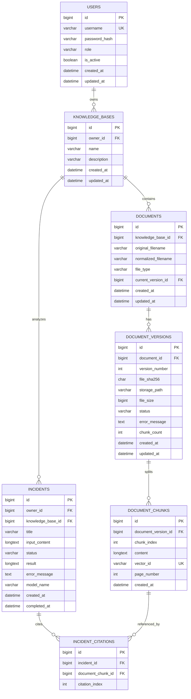

# DevAtlas 数据库关系图

## 1. P0 数据库关系



## 2. 关系说明

```text
users 1:N knowledge_bases
  一个用户可以拥有多个知识库。

knowledge_bases 1:N documents
  一个知识库包含多个逻辑文档。

documents 1:N document_versions
  同一个逻辑文档内容变化时创建新版本，而不是创建新的逻辑文档。

document_versions 1:N document_chunks
  每个版本解析并切分成多个文档块。

knowledge_bases 1:N incidents
  故障分析记录属于一个知识库和一个提交用户。

incidents 1:N incident_citations
  一个故障分析结果可以引用多个文档块。
```

## 3. MySQL 与 Chroma 的分工

```text
MySQL
  用户、权限、知识库、文档、版本、chunk 原文、incident 和引用关系

Chroma
  文档块向量、文本副本和 metadata，用于相似度检索

文件系统
  原始上传文件
```

Chroma 中的稳定向量 ID 格式：

```text
kb:{knowledge_base_id}:doc:{document_id}:version:{version_id}:chunk:{chunk_index}
```

## 4. 关键约束

- `users.username` 唯一；
- 同一用户下知识库名称不能重复；
- 同一逻辑文档的 `version_number` 递增；
- 同一文档相同 `file_sha256` 不重复创建版本；
- 同一版本的 `chunk_index` 唯一；
- `vector_id` 全局唯一；
- 只有 `indexed` 版本的 chunk 可以被检索；
- 查询业务表时必须带当前用户或知识库权限边界；
- 删除文档时先清理 Chroma 和原始文件，再删除 MySQL 记录。

## 5. 状态流转

### 文档版本

```text
pending → indexed
pending → failed
failed  → indexed（重新索引成功）
```

### 故障分析

```text
streaming → completed
streaming → failed
streaming → cancelled
```

`conversations`、`messages` 和 `message_citations` 属于 P1 设计，当前 MVP 不创建和使用这些表。
