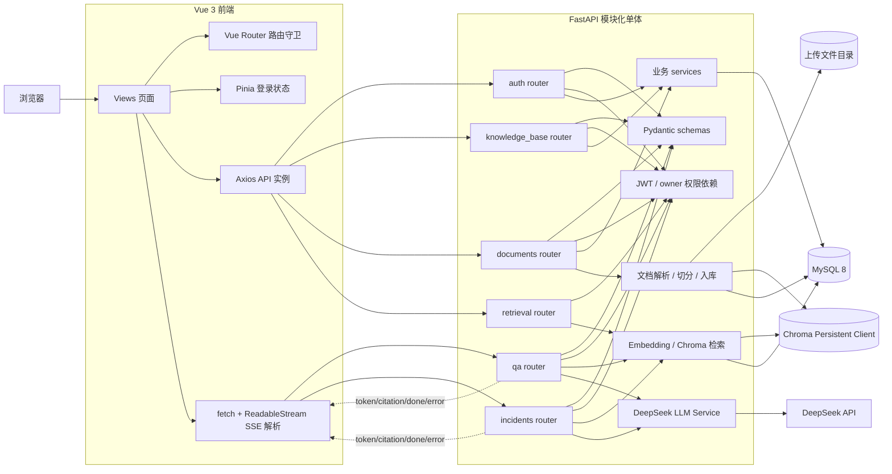
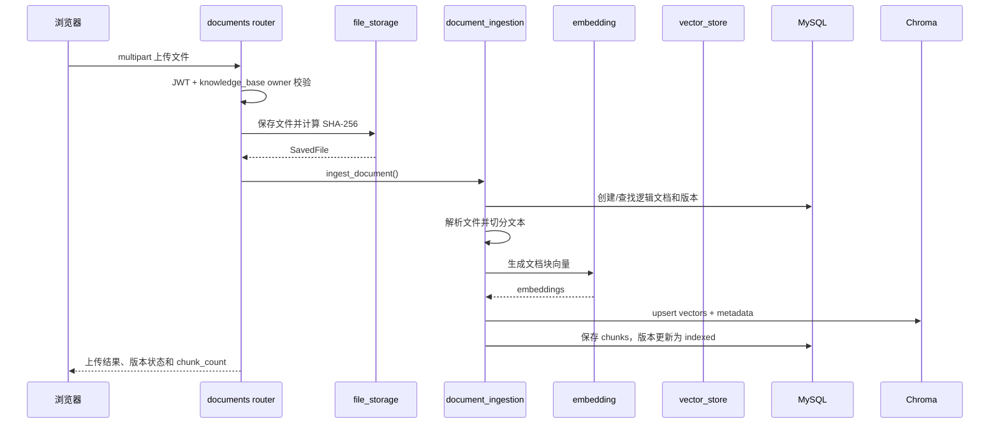
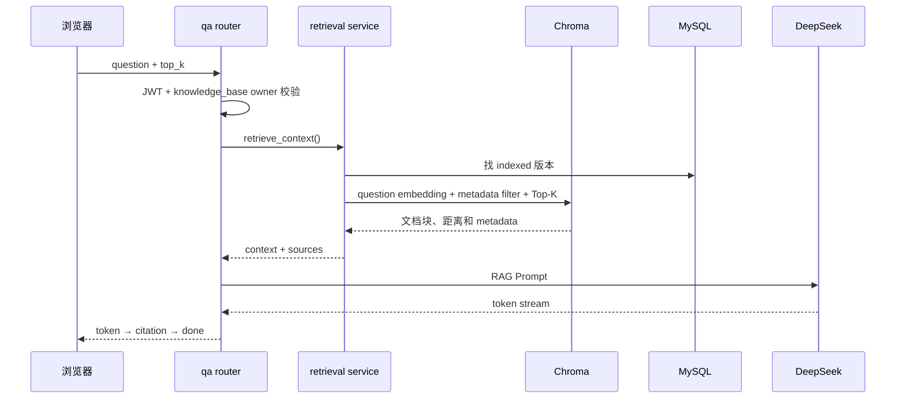

# DevAtlas 系统架构图

## 1. 当前 MVP 架构

DevAtlas 采用模块化单体架构：前端、FastAPI 后端、MySQL、Chroma、文件系统和 DeepSeek 在本机协同运行。当前不引入微服务、消息队列、Redis 或 Agent 编排。



## 2. 后端目录职责

```text
backend/app/core
  配置、JWT、当前用户依赖、文件安全

backend/app/db
  SQLAlchemy Base、Engine、Session

backend/app/models
  users、knowledge_bases、documents、versions、chunks、incidents

backend/app/schemas
  请求参数和响应结构

backend/app/routers
  HTTP 路由、鉴权依赖和状态码转换

backend/app/services
  文档处理、Embedding、Chroma、检索、LLM 和 incident 业务
```

## 3. 文档入库调用链



## 4. RAG 普通问答调用链



## 5. 关键边界

- 前端路由守卫只改善用户体验，最终权限必须由后端 `current_user` 和 `owner_id` 再次校验；
- MySQL 保存业务事实，Chroma 只作为语义检索索引；
- 只有 `indexed` 版本允许进入默认检索；
- SSE 建立后，业务错误通过 `error` 事件传递，不能只看 HTTP 200；
- T14 只实现 MVP 主链路，不包含问答历史会话、Redis、Agent、Reranker 和 Docker 部署。
