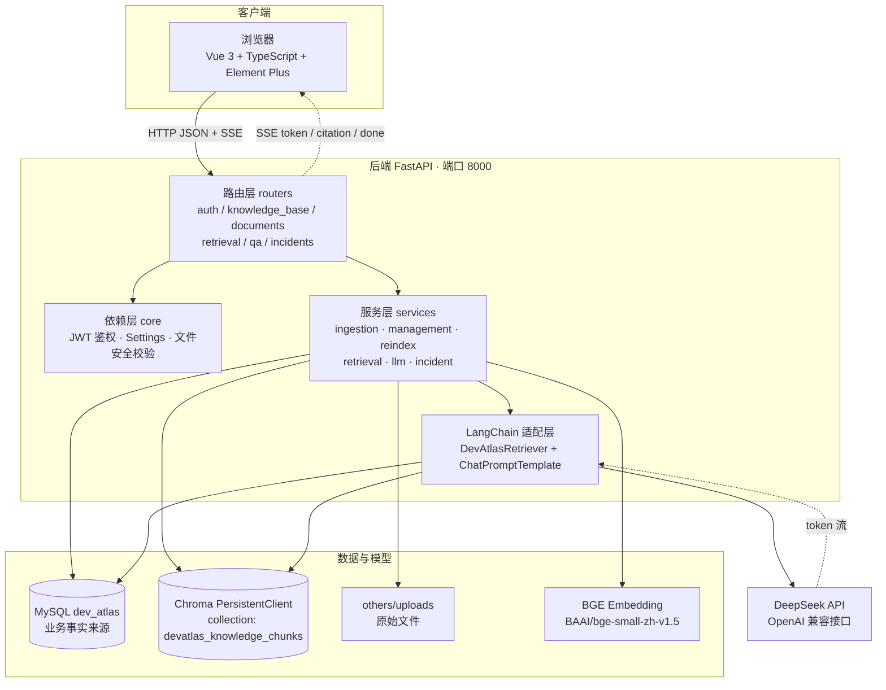
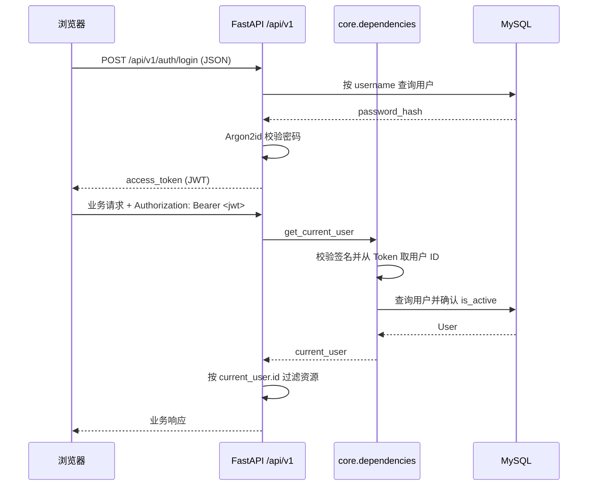
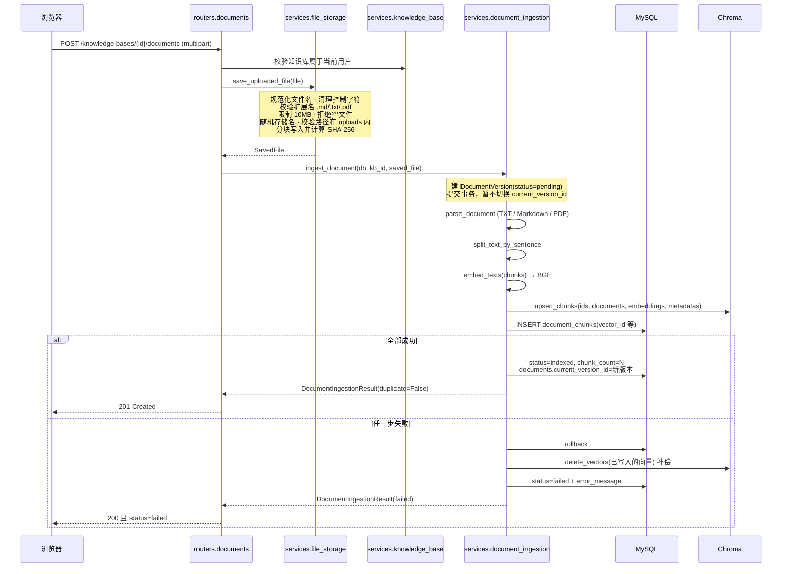
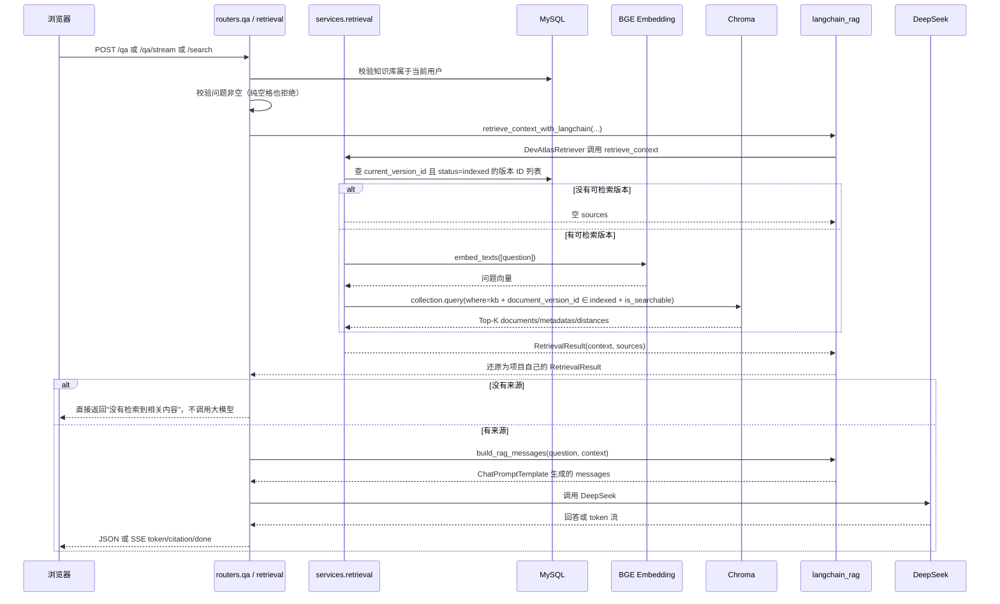
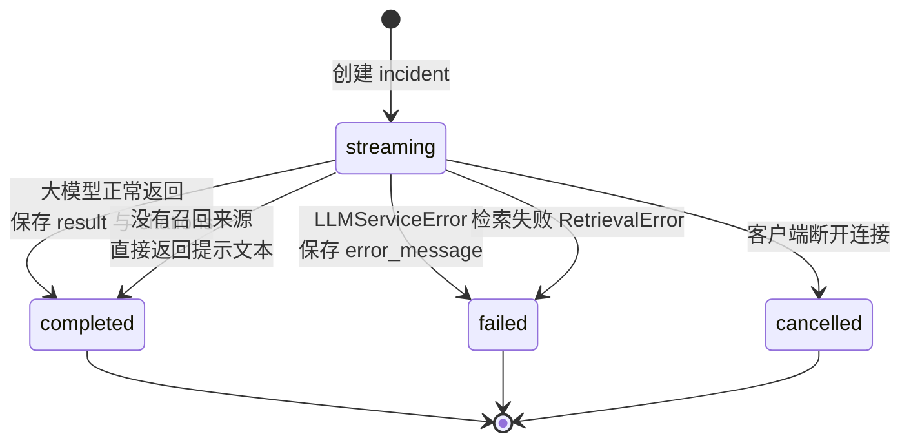
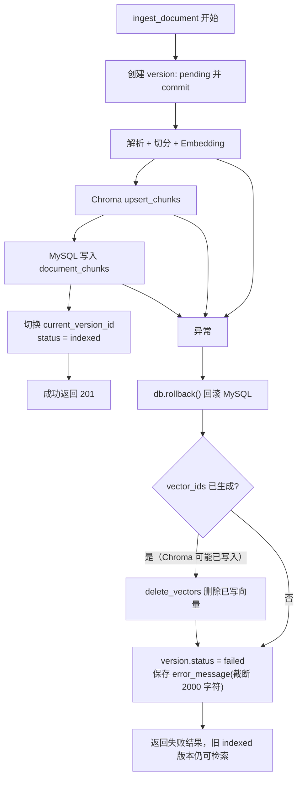
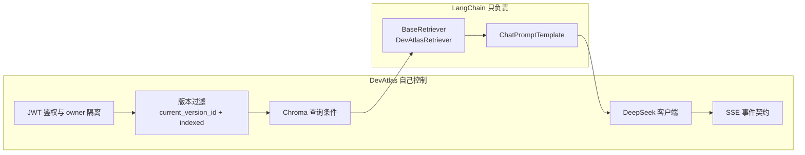

# DevAtlas 架构说明

本文档描述 DevAtlas **当前真实实现**的架构。所有结论均来自 `backend/app` 与
`frontend/src` 的源码。DevAtlas 目前是**开发环境 / MVP**项目，没有生产环境部署，
因此本文不包含负载均衡、容器编排、缓存集群等内容。

## 一、总体架构



组件职责与边界：

| 组件 | 真实职责 | 明确不负责 |
| --- | --- | --- |
| Vue 3 前端 | 页面交互、路由守卫、Axios 携带 JWT、`fetch + ReadableStream` 解析 SSE、Markdown 安全渲染 | 不直连 DeepSeek，不直连数据库 |
| FastAPI 路由层 | 参数校验、鉴权依赖、HTTP 状态码映射、SSE 响应封装 | 不写业务规则 |
| 服务层 | 解析、切分、向量化、版本状态流转、检索、LLM 调用、故障记录 | 不处理 HTTP 细节 |
| MySQL | 用户、知识库、逻辑文档、版本元数据、chunk 原文、故障记录与引用 | 不做相似度检索 |
| Chroma | chunk 向量与检索 metadata | 不作为业务事实来源 |
| BGE Embedding | 本地把问题和 chunk 转成向量 | 不参与权限判断 |
| DeepSeek | 基于检索上下文生成回答 | 不做检索，不决定引用来源 |

## 二、请求与鉴权链路



权限隔离规则：

- `owner_id` 一律由服务端从 JWT 推导，**不信任**客户端传入的所有者 ID；
- 知识库、文档、版本、故障记录的查询与删除全部叠加 owner 条件；
- 跨用户访问统一返回 `404` 而不是 `403`，避免通过状态码探测资源是否存在；
- 登录失败只返回统一的凭据错误，避免用户名枚举；
- 用户被停用返回 `403`。

## 三、文件上传和索引链路

上传接口会一次性完成「安全保存 → 解析 → 切分 → 向量化 → 入库 → 版本切换」。



关键设计点：

1. **先建版本再处理**：版本记录以 `pending` 落库并提交，之后的解析和向量化不在同一个
   事务里，因此失败时已经建好的版本记录仍然存在，可以记录失败原因；
2. **延迟切换当前版本**：处理过程中不修改 `documents.current_version_id`。只有全部步骤
   成功才切换。这样失败时旧的 `indexed` 版本继续参与检索，用户不会因为一次失败的上传
   丢掉已有知识；
3. **SHA-256 幂等**：同一逻辑文档下 `(document_id, file_sha256)` 有唯一约束。重复上传
   相同内容会直接复用已有版本、删除刚写入的临时文件，并返回 `duplicate=true`
   （HTTP 状态码为 `200` 而不是 `201`）；
4. **存储路径脱敏**：数据库只保存相对于项目根目录的路径，避免把本机绝对路径暴露给 API。

## 四、RAG 检索和问答链路



Chroma 检索的真实过滤条件（`services/retrieval.py`）：

```python
{
    "$and": [
        {"knowledge_base_id": knowledge_base_id},
        {"document_version_id": {"$in": indexed_version_ids}},
        {"is_searchable": True},
    ]
}
```

其中 `indexed_version_ids` 来自 MySQL 的关联查询：
`Document.current_version_id == DocumentVersion.id` 且 `DocumentVersion.status == "indexed"`。
**每个逻辑文档最多只有一个版本参与检索**，这是「版本化」在检索侧落地的关键。

Chroma 集合名为 `devatlas_knowledge_chunks`，距离空间为余弦（`hnsw:space = cosine`）。

## 五、SSE 流式输出

问答流式接口与故障分析流式接口共用同一套事件契约：

| 事件 | 数据 | 说明 |
| --- | --- | --- |
| `token` | `text` | 增量文本片段 |
| `citation` | `index`、`document_id`、`version_id`、`version_number`、`chunk_index`、`filename`、`distance` | 引用来源，在 token 之后发送 |
| `done` | 问答：`conversation_id`、`message_id`；故障：`incident_id`、`status` | 正常结束 |
| `error` | `code`、`message` | 大模型服务不可用 |

实现要点：

- 使用 FastAPI 的 `StreamingResponse`，`media_type="text/event-stream"`；
- 响应头额外设置 `Cache-Control: no-cache`、`Connection: keep-alive`、
  `X-Accel-Buffering: no`，避免中间层缓冲导致流式失效；
- `data` 用 `json.dumps(..., ensure_ascii=False)` 生成，中文不会被转义；
- 前端用 `fetch + ReadableStream` 解析（`frontend/src/api/sse.ts`），
  不用 `EventSource`，因为 `EventSource` 无法携带自定义的 `Authorization` 头；
- 客户端断开时生成器收到 `GeneratorExit`，故障分析会把记录标记为 `cancelled`。

## 六、故障分析

故障分析是独立业务链路，**不写回知识库文档**。



- 检索 query 是「标题 + 换行 + 故障描述」，`top_k` **固定为 5**；
- 引用关系写入 `incident_citations`，通过 `document_chunk_id` 指向具体切片，
  因此历史故障的引用可以回溯到当时的原文；
- 检索失败时抛 `HTTPException(503)`，此时是 HTTP 错误而不是 SSE `error` 事件；
  大模型失败时才会发送 `error` 事件。

## 七、失败回退与跨存储补偿

MySQL 和 Chroma 是两个独立的存储系统，无法用同一个事务覆盖，因此需要显式补偿。



补偿策略总结：

| 失败位置 | MySQL 处理 | Chroma 处理 | 用户可感知结果 |
| --- | --- | --- | --- |
| 解析 / 切分 | 回滚，版本标记 `failed` | 尚未写入，无需补偿 | 旧版本仍可检索 |
| Embedding | 回滚，版本标记 `failed` | 尚未写入，无需补偿 | 旧版本仍可检索 |
| Chroma 写入 | 回滚，版本标记 `failed` | 删除本次已写入的向量 | 旧版本仍可检索 |
| MySQL chunk 写入 | 回滚，版本标记 `failed` | 删除本次已写入的向量 | 旧版本仍可检索 |

删除文档时的顺序也是出于一致性考虑：

```text
先删除 Chroma 向量 → 再删除原始文件 → 最后删除 MySQL 业务记录
```

原因是 `vector_id` 存放在 MySQL 的 `document_chunks` 中。如果先删 MySQL，就会丢失清理
向量所需的 ID，Chroma 中会残留永远无法定位的孤立向量。

失败版本可以通过重新索引接口重试：`POST .../documents/{document_id}/reindex`
只会处理最新的 `failed` 版本；没有 `failed` 版本时返回 `409`。

## 八、LangChain 的接入位置

LangChain 在本项目中的接入点是**刻意收窄**的，只出现在两个位置：



具体说明：

- `backend/app/services/langchain_rag.py` 定义了 `DevAtlasRetriever(BaseRetriever)`，
  但它的 `_get_relevant_documents()` 内部调用的仍是项目自己的 `retrieve_context()`。
  也就是说权限校验、版本过滤和 Chroma 查询条件完全保留在自有代码里，LangChain
  只是提供了一个标准 Retriever 接口形状；
- 检索结果被转换成 `langchain_core.documents.Document`，再由适配层把 metadata 还原成
  项目自己的 `RetrievedChunk`，因此**对外 API 响应结构没有因为引入 LangChain 而改变**；
- Prompt 使用 `ChatPromptTemplate` 组织（`services/llm.py` 中的 `build_rag_messages`
  与 `build_incident_messages`），再交给 OpenAI 兼容客户端调用 DeepSeek；
- **没有使用** LangChain 的 Agent、Chain 编排、Memory，也没有使用它的向量库封装。

这样划分的原因：版本过滤和 owner 隔离是业务正确性的前提，如果交给框架的默认行为，
一旦框架默认检索范围发生变化，就可能出现越权或召回失效，属于不可接受的风险。

## 九、数据一致性

| 一致性问题 | 当前做法 |
| --- | --- |
| 重复上传同一内容 | `(document_id, file_sha256)` 唯一约束 + 上传前查询，幂等复用 |
| 同知识库同名文件 | `(knowledge_base_id, normalized_filename)` 唯一约束收敛到同一逻辑文档 |
| 新版本处理失败 | 延迟切换 `current_version_id`，旧版本继续可检索 |
| Chroma 写入后失败 | `delete_vectors` 补偿删除 |
| 删除文档 | 先向量、再文件、最后 MySQL 记录 |
| 检索越权 | 过滤条件同时包含 `knowledge_base_id` 与当前 owner 的知识库校验 |
| 检索到历史版本 | 只召回 `current_version_id` 且 `status=indexed` 的版本 |
| 逻辑文档与版本循环外键 | `documents.current_version_id` 使用 `SET NULL`，版本删除不会级联删除文档 |

明确的一致性边界（**待确认 / 未实现**）：

- 没有跨存储的分布式事务，补偿失败时只记录日志，需要人工介入；
- 没有定时对账任务来发现 Chroma 与 MySQL 的残留差异；
- 删除顺序中若「删除原始文件」失败会返回 `500`，此时数据库记录尚未删除，需要重试。

## 十、部署形态

当前只有一种运行形态：**本机开发环境**。

```text
浏览器 http://127.0.0.1:5173
        │  Vite dev server（前端开发服务器）
        ▼
FastAPI http://127.0.0.1:8000 （uvicorn --reload）
        ├── MySQL 127.0.0.1:3306 / dev_atlas
        ├── Chroma 持久化目录 others/chroma
        ├── 上传目录 others/uploads
        ├── BGE Embedding 本地推理
        └── DeepSeek 云端 API
```

CORS 白名单目前只允许 `http://127.0.0.1:5173` 和 `http://localhost:5173`，
修改前端端口或域名时必须同步修改 `backend/app/main.py`。

尚未实现（**不要描述为已有能力**）：Docker 镜像、容器编排、Nginx 反向代理、
HTTPS 终止、进程守护、多实例部署、集中式日志与监控、Redis 缓存、消息队列。
生产化所需的密钥托管、限流、审计日志同样尚未实现。
